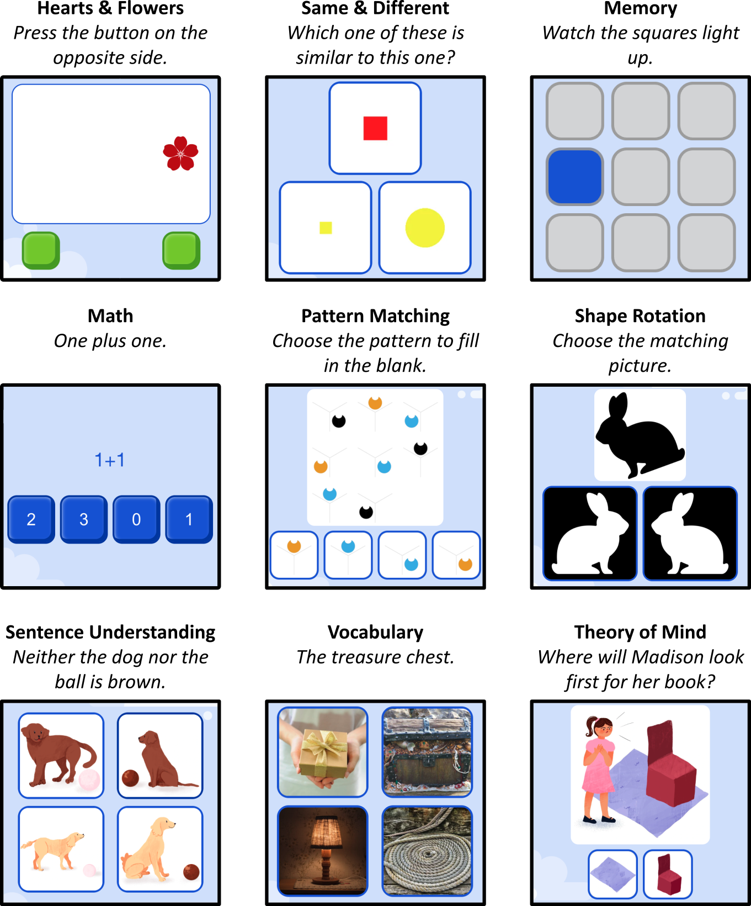

```{r setup}
#| include: false
#| cache: false

library(tidyverse)
library(here)
library(glue)
library(purrr)
library(readxl)

library(flextable)
library(ftExtra)
library(ggh4x)
library(viridis)

library(lavaan)
library(broom)
library(marginaleffects)
```

```{r settings}
#| cache: false

levante_dir <- here("../..")
source(here(levante_dir, "levante-data-meta/plot_settings.R"))
.scale_colour_site <- scale_colour_ptol
.scale_fill_site <- scale_fill_ptol

# settings for flextable
set_flextable_defaults(theme_fun = theme_apa, arraystretch = 1, padding = 1, line_spacing = 1)
gray_border <- officer::fp_border(color = "gray")

# seed for random number generation
set.seed(42)
knitr::opts_chunk$set(cache.extra = knitr::rand_seed)

# helper for formatting p-values
pval_fmt <- function(x) ifelse(x < .001, "<.001", sub("^0\\.", ".", sprintf("%.3f", x)))
```



# Introduction

Developmental variability and change in childhood is a topic of substantial theoretical and practical interest. Whether tracking children's growth over time, evaluating intervention outcomes, or examining environmental moderators, many scientific aims require accurate assessment tools [@rubio2016concurrent]. Ideally, psychological measures are efficient, reliable, valid, and usable across ages, situations, and contexts. In practice, however, researchers face a landscape that falls far short of this ideal, with gaps stemming from limited age coverage, variability across contexts, and restricted access to high-quality measures [@mchenry2023current].

Because children's overall capacities are so dependent on their age, it can be very challenging to use the same measure across children of different ages [@cappa2021identifying]. Young children require simple tasks that are not verbally demanding, while older children can answer more complicated questions, and can become bored if given too many simple questions. In addition, younger children typically require shorter tasks, often reducing measurement reliability. Yet giving different tasks to different ages can mean that scores are not comparable, making tracking developmental growth challenging in many domains.  

A second set of challenges concern cross-context comparisons. Ideal developmental measures should be validated in a global context and applicable to children across many cultures and languages [@bohn2024]. Child development is an issue of global importance [@grantham2007developmental;@masten2014global;@aboud2015global], yet the vast majority of developmental measures are developed in very specific (often English-speaking) contexts [@kidd2022diverse;@singh2023diversity;@richter2019early]. 

A final set of challenges has to do with accessibility. Many gold-standard measures are commercially distributed. They are costly for researchers to use, and in addition, publishers may place barriers on new translation and adaptation. Publishers also typically hold both item information and normative data closely, blocking many types of secondary investigation. 

## LEVANTE

The Learning Variability Network Exchange (LEVANTE) was designed to address these challenges [@frank2025] by validating an openly accessible set of measures applicable to a wide developmental age range within varied contexts. LEVANTE adopts a software framework from the Rapid Online Assessment of Reading (ROAR) to facilitate data collection with these measures. The ROAR dashboard is a web interface to assign both task bundles and surveys to groups of children, caregivers, and teachers. LEVANTE "forked" (duplicated) the ROAR dashboard and modified it for international research with the addition of a framework for data harmonization and validation. Data collected through the dashboard are harmonized into a centralized data repository and made accessible first to the researchers who collected them and then, through regular data releases, to the broader research community. Through a partnership with the Jacobs Foundation, sites around the world are funded to collect longitudinal data from children using the LEVANTE framework. The eventual goal of LEVANTE is to create and openly share a rich dataset and suite of measures documenting children's learning and development across contexts. Code and data for reproducing this paper are available at https://github.com/levante-framework/levante-pilots.

The current manuscript introduces the LEVANTE core tasks, a suite of behavioral measures for children, and draws on data from the now-completed pilot phase of the project, which we used to evaluate and refine the tasks' reliability, validity, and feasibility across sites and age groups. In our initial development of the task battery, we cast a broad net for important constructs in child development with well-accepted measures that had been used internationally. This process is described in @frank2025. The broad constructs that we selected were executive function, language, mathematics, reasoning, and social cognition, with these being instantiated through a number of well-accepted task types. 

To create our core tasks, we selected pre-existing measures from the literature that tapped each of these constructs. When possible, we prioritized measures with strong psychometric properties, previous use across a broad range of cultures, applicability across a broad range of ages, and lack of commercial or licensing constraints. Although very few measures met all our criteria, this search yielded a series of candidate measures, which we adapted and re-implemented in an open source web platform. @tbl-tasks shows these tasks, organized by construct. Some of these implementations remained quite close to prior versions, while others, by necessity, required the creation of additional test items (e.g. for longitudinal retest and cultural appropriateness) or changes to specifics of their procedure. 

In addition to the constructs described above, we were also interested in the assessment of literacy. The LEVANTE task battery makes use of a number of previously-validated literacy tasks from the Rapid Online Assessment of Reading [@yeatman2021], including Single Word Reading (ROAR-Word) [@yeatman2021; @ma2025roar], Sentence Reading Efficiency (ROAR-Sentence) [@yeatman2024development], and Phonological Awareness (ROAR-Phoneme) [@gijbels2024rapid]. Because they are extensively described elsewhere, we do not report on these tasks here, though we make use of literacy data for validation of language measures. For validation of our executive function measures, we also included a commercially-available broad measure of executive function, the Minnesota Executive Function Scale (MEFS), for which substantial reliability and validity evidence has already been gathered [@carlson2021]. 

::: {.landscape}
```{r}
#| label: tbl-tasks
#| tbl-cap: "The LEVANTE core tasks, presented with their simplified labels as well as prior labels used in the literature."

task_table <- tribble(
  ~task_code, ~source_name,                                                                           ~citation,
  "hf",       "Assessment of Motivation, Effort, and Self-Regulation (AMES) Hearts and Flowers Game", "@davidson2006",
  "sds",      "Something's the Same",                                                                 "@willoughby2011",
  "sds",      "Flexible Item Selection Task (FIST)",                                                  "@jacques2001",
  "mg",       "Assessment of Motivation, Effort, and Self-Regulation (AMES) Memory Game",             "@corsi1972",
  "math",     "Early Grade Math Assessment (EGMA)",                                                   "@platas2014",
  "matrix",   "Matrix Reasoning Item Bank (MaRs-IB)",                                                 "@chierchia2019",
  "mrot",     "Mental Rotation",                                                                      "@frick2013",
  "trog",     "Test for Reception of Grammar (TROG)",                                                 "@bishop1982",
  "vocab",    "Peabody Picture Vocabulary Test (PPVT)",                                               "@dunn2007",
  "tom",      "Theory of Mind",                                                                       "@sotomayor-enriquez2024"
) |>
  left_join(task_info, by = c("task_code" = "item_task")) |>
  arrange(task) |>
  select(task_category, task, source_name, citation) |>
  mutate(task = if_else(task == lag(task) & !is.na(lag(task)), "", task),
         task_category = if_else(task_category == lag(task_category) & !is.na(lag(task_category)), "", task_category))

task_ft <- task_table |>
  flextable() |>
  set_header_labels("task_category" = "Construct",
                    "task" = "LEVANTE task name",
                    "source_name" = "Prior/source task name",
                    "citation" = "Most similar source citation") |>
  colformat_md() |>
  align_text_col() |>
  hline(~lead(task_category) != "", border = gray_border)

# set column widths to min needed to fit text on one line, except for source
ftw <- dim_pretty(task_ft)$widths
ftw[3] <- 8.5 - sum(ftw[-3])

task_ft |>
  width(width = ftw) |>
  valign(valign = "top")
```
:::

## The current study

Here we report on the development and validation of the LEVANTE core tasks. This was an iterative process in which data from 5--12 year old children were collected at four sites: Bogota, Caquetá (uniandes-co-bogota) and Boyacá, Colombia (uniandes-co-rural); Leipzig, Germany (mpieva-de); and Ontario, Canada (western-ca).^[In the remainder of the manuscript, we refer to these sites by their site designators, uniandes-co-bogota,  uniandes-co-rural, mpieva-de, and western-ca. These designators mark the research group and country/region of data collection. We make this choice to avoid the inference that these data are particularly representative of Canadian, German, or Colombian children more broadly.] 

Our practices in this manuscript reflect an evolving set of measures -- in this sense, LEVANTE is a "ship that is being built as we sail." In some cases, we used data gathered during the pilot data collection process to make minor changes to the tasks. We also used data from these four pilot sites to develop efficient, computer adaptive task (CAT) versions of many of the tasks. Thus, our report here reflects progress to date -- a pilot-validation study during which the measures were refined -- rather than a full validation study of a finished measurement battery. <!-- clarified for reviewers, but maybe we now can say it's nearly done? --> 

Psychometric models based on item-response theory (IRT) are a key component of our process for developing the LEVANTE core tasks [@embretson2013]. IRT provides a family of models that allow the joint estimation of the difficulty of individual task items (e.g., math questions) and the ability of individual children. A fitted IRT model provides task parameters that can be used to estimate the ability of a new test taker given their responses on some or all of the same items. In addition, IRT parameters are used in the construction of CATs, which choose the most relevant subset of items to present, to estimate the ability of a particular individual. Critically for our purposes, the use of IRT models means that we can provide comparable scores on the same scale for both a younger child who saw mostly easier task items and an older child who saw harder items. These models thus allow us to address our first key challenge posed above: limited coverage across age groups.

Because our data come from four sites, each with their own translations and adaptations of the specific tasks, we can also use multi-group IRT models to explore the question of measurement invariance: whether measures function similarly across different groups [@putnick2016]. While measurement invariance is more commonly discussed in the factor analytic literature, it is also applicable to IRT (where it is sometimes analyzed at the level of individual test items as "differential item function" across groups) [@thissen2025]. Here we use multi-group model comparisons (described below) to investigate whether our tasks operate similarly across groups. In particular, where possible, we aim for *scalar invariance*, in which different groups still show the same relative ordering of difficulty across items (e.g., fraction items are harder than division items in a math test). In some cases, we may fall back to *metric invariance*, in which items show different difficulties across groups (e.g., $7\times9$ is harder for one group than another), or *configural invariance*, in which items show different degrees of ability discrimination as well (e.g., if some problem types are unfamiliar to children in one group and so do not discriminate between high and low ability children). These models allow us to begin to address the second challenge posed above: variability across contexts.

<!-- https://www.tandfonline.com/doi/10.1080/00273171.2024.2396148 -->

Although we are interested in using psychometric models to create comparable scores for our tasks, the goal of LEVANTE is not to measure absolute differences between sites. Indeed, site comparisons are not possible in our framework. Our pilot sites and future LEVANTE sites differ widely in the details of sampling, recruitment, and administration, making differences in absolute performance across sites highly confounded. Thus, although below we present data that suggest absolute performance differences between sites, we caution that these are uninterpretable. This is a distinct question from whether scores can be placed on a common *scale* across sites (as the described multi-group models allow). The use of a common scale allows the pooling of data across sites for developmental, reliability, and validity analyses. It does not, however, license comparison of absolute ability levels between sites.

In what follows, we begin by describing the nine LEVANTE core tasks, organized by construct. We then discuss the process of translation and adaptation that produced the Spanish and German versions of these tasks from the original English source. Next we describe our pilot data collection. We subsequently present our IRT-based scoring techniques and the results of multi-group comparison, in some cases after selectively removing items that show poor psychometric properties. Using scores from these analyses, we then present evidence on the reliability and validity of the tasks, noting that many are still under development and that we expect their psychometric properties to improve as items are iteratively refined and more data are collected.

We end by discussing future plans for further internationalization and downward extension of the tasks (i.e., adapting them for younger children). Critically, LEVANTE embraces open science values, aiming to create measures and data that are permissively licensed and reusable and extensible by the international research community. These values address our final challenge posed above: the aim of LEVANTE is to minimize barriers to reuse, accelerating progress towards a global science of learning and development. 



# The LEVANTE Core Tasks

## General task properties

The LEVANTE core tasks are brief behavioral assessments that can be delivered in a web browser on a tablet or laptop, with responses made via touchscreen, keyboard, or mouse. Because administration formats vary, the tasks prioritize response accuracy rather than reaction time (and are therefore mostly untimed). However, reaction times are still recorded for all tasks. The tasks are deliberately designed for simplicity and clarity so they remain accessible to children across a wide age range. With only modest exceptions, nearly all follow a multi-alternative forced-choice format (up to four options) and use colored illustrations.[^1] This uniformity of format means that in most cases, instructions can be short and easy to understand, minimizing delays when the tasks are given in sequence as a battery. @fig-tasks shows screenshots from each of the tasks. Below we briefly present each task.

[^1]: The vocabulary task uses photographs, and the math task shows only text.

{#fig-tasks width="90%"}

Tasks were implemented using jsPsych [@de-leeuw2015] in a common framework. Illustrations were produced by hand, while auditory stimuli were generated using AI-based voice synthesis tools (<https://elevenlabs.io>), which enabled rapid and iterative revisions without the need for rerecording. The tasks generally share a set of usability features including simple instructions, a small number of practice trials, and buttons to replay audio.

All tasks are available for demonstration purposes at <https://researcher.levante-network.org>. Source code for the tasks is available at <https://github.com/levante-framework/core-tasks>. Task code and assets are licensed CC-BY-NC 4.0 for non-commercial reuse (including educational use by not-for-profit and governmental entities) with appropriate attribution. Please see the license file available in the repository for more details. Once the researcher management dashboard is completed, interested researchers will be able to create accounts and use the tasks in their own research. 



```{r}
#| dependson: time-summary
#| label: tbl-durations
#| tbl-cap: "Median task durations (minutes) and median number of trials for non-adaptive (left) and adaptive (right) versions of each task, across all sites. Adaptive durations and trial counts include in parentheses what percentage that value is of the corresponding non-adaptive value."

task_time_table |>
  filter(site_label == "All") |>
  select(-site_label) |>
  flextable() |>
  set_header_labels("task" = "Task",
                    "combined_diff_non_adaptive" = "Non-adaptive",
                    "combined_diff_adaptive" = "Adaptive",
                    "combined_trials_non_adaptive" = "Non-adaptive",
                    "combined_trials_adaptive" = "Adaptive") |>
  add_header_row(values = c("", "Median duration (minutes)", "Median trials"), colwidths = c(1, 2, 2)) |>
  align_text_col() |>
  align(j = 2:5, align = "right", part = "all") |>
  align(i = 1, align = "center", part = "header") |>
  hline(i = 1, border = gray_border, part = "header") |>
  hline(i = 1, j = 1, border = officer::fp_border(color = "white"), part = "header") |>
  autofit()
```

General task lengths are described below and average task durations from pilots (for both adaptive and non-adaptive versions) are given in @tbl-durations. Because of our interest in testing children across a wide range of ages, we intentionally included trials that we anticipated would be both very easy and very hard for children with the aim of deploying these items adaptively after we had gathered sufficient data. We wanted to avoid frustration for children, however, so during pilot testing, we experimented with a number of different stopping rules. In early iterations of pilot testing at the Colombia site (uniandes-co), we ended tasks after three consecutive incorrect trials; we later modified this rule to end tasks after six consecutive incorrect trials. These differences explain some of the disparate task lengths that are observed (e.g., very short task lengths for Pattern Matching in uniandes-co). 

## Language 

### Sentence Understanding

The Test for Reception of Grammar (TROG) [@bishop1982] is a multiple-choice measure of receptive grammatical understanding. On each trial, the child hears a spoken sentence (e.g., "The cow is pushed by the girl.") and is asked to select one of four pictures that best matches its meaning. The original test contained 20 blocks, each with four items assessing the same grammatical structure. In our adaptation of the original TROG (which was permissively licensed for reuse), we removed several items that no longer reflected contemporary cultural norms, particularly those involving gender stereotypes. In addition, based on early pilot testing showing that many trials were easy for older children, we added a set of several dozen more challenging sentences. All illustrations were remade with details intended to be accessible across a broad range of cultures. 

### Vocabulary

The Vocabulary task was developed as a non-commercial, open alternative to tasks such as the Peabody Picture Vocabulary [@dunn1965] and the NIH Toolbox Picture Vocabulary Task [@zelazo2013national]; see @long_ma_tan_silverman_frank_yeatman_2025 for more details. In this task, children hear a target word read aloud and are shown four pictures. They must identify the picture that matches the word among three distractors. A first set of targets and distractors were sourced from the THINGS+ dataset [@hebart2019things; @stoinski2024thingsplus], specifically from the permissively-licensed subset of the data; in this item subset (108 items) each image had a semantically close and semantically far distractor as well as an unrelated distractor image (e.g., target word "acorn" with close distractor being a "coconut", and the far and unrelated distractors being "keys" and "laundry").  Additional difficult items were included beyond those analyzed in @long_ma_tan_silverman_frank_yeatman_2025. These more difficult items were sourced and translated from an open-sourced Dutch receptive vocabulary assessment tool, the DAIVT [@bousard2021dutch]; we also manually constructed several of our own items to reach a total of 170.

## Math

We developed the Math task based on the EGMA (Early Grade Mathematics Assessment) [@platas2014]. This short, paper-and-pencil assessment is widely administered in international contexts for children ages 5--8 and includes number identification, number comparison, missing number, addition, and subtraction sub-tests. In our adaptation, we increased the breadth of the initial item bank, added multiplication, division, and fractions items to extend up to content that might be encountered by approximately age 12 years. We also included number line identification problems in which children were asked to place a marker on a number line across a range of scales (including simple 0–10 trials, larger whole-number scales, and a fraction scale). Number line tasks of this type are known to be strongly associated with mathematical ability [@schneider2018].  

## Reasoning

### Pattern Matching

In classic matrix reasoning tasks, participants see a set of abstract figures in a grid format with a missing cell and must choose the most appropriate figure to complete the grid. Matrix reasoning scores are highly correlated with general cognitive ability and educational attainment [e.g., @roth2015]. Here we make use of the Mars-IB matrix reasoning stimuli, an open-source, permissively-licensed set of matrix reasoning problems with retest variants that have been normed with a large sample of adolescents and adults [@chierchia2019].
 
### Shape Rotation

Mental rotation refers to the ability to imagine the rotation of objects in space, which is strongly related to mathematics and reasoning abilities [@xie2020]. In our version of the mental rotation task [based on @frick2013], children are presented with a target item (e.g., a picture of a rabbit). Then, they are presented with two comparison items (e.g., two silhouettes of rabbits). One of the comparison items will match the target item when rotated; the other comparison item will not match the target item when rotated. The child must select the comparison item that matches the target item. Both accuracy and reaction time are measured. Across trials, the degree of rotation varies (e.g., 40, 80, 120, 160 degrees), affecting children's accuracy and reaction time. We included both two-dimensional duck and rabbit stimuli as well as harder three-dimensional geometric figures from the original stimulus set developed by @shepard1971. 

## Executive Function

### Same and Different 

The Same Different Selection (SDS) task was designed to assess cognitive flexibility in children [@obradovic2025sds]. It incorporates elements from the "Something's the Same" task [@willoughby2011] and "Flexible Item Selection Task" [@jacques2001] as initial task blocks and extends these tasks by including more advanced blocks that increase the number of conceptual dimensions, values per dimension, and number of presented cards. Children are presented with sets of cards that show geometric figures that vary along multiple dimensions, such as shape, color, size, and number. They are required to identify similarities and differences between cards based on these dimensions (e.g., choosing a pair of cards with figures that share the same color and then choosing a pair of cards that share the same number of figures), by engaging their ability to shift attention from previously identified dimensions and identify new matching dimensions criteria. The version of the task we adapted included successively more difficult blocks of trials in which children were asked to identify two, three, or four pairs of items that were the same in different ways (e.g., matching on different dimensions). 

### Hearts and Flowers

The Hearts and Flowers task assesses inhibitory control and cognitive flexibility [@davidson2006]. We modeled the task design after the AMES tablet task version which has been tested in many global settings including Ghana and Côte d'Ivoire [@khan2024modeling; @ahmed2022directly]. Participants respond according to stimulus type: pressing a key on the same side as a heart (congruent rule), and on the opposite side for a flower (incongruent rule). The task includes three blocks: congruent (hearts only), incongruent (flowers only), and mixed (hearts and flowers). The congruent block serves as a baseline with minimal executive demands. Participants in our version of the task are encouraged to respond as quickly as possible but -- due to variation in administration platform and in contrast to some versions of the task -- we did not provide a hard time limit on each trial, though we scored responses slower than 3000 ms as incorrect.  

### Memory

The Corsi Block task is a widely-used measure of visuospatial short-term and working memory [@corsi1972]. In our version of the task modeled after the AMES tablet task version [@obradovic2025motivation], the child sees a grid of squares; during each trial, a subset of squares lights up one at a time in a specific sequence. The child is required to reproduce the sequence by touching the squares: in the first block, the sequence is reproduced in the same order and in the second block, it is reproduced backwards. The task begins with short sequences (e.g., two items) and gradually increases in difficulty (up to seven items) until the child fails two sequences of the same length. We used both 2x2 and 3x3 grids in our pilot testing, with relatively similar results. 

## Social Cognition

### Stories

Assessing social cognition across a wide range of ages is a challenge, and relatively few instruments show good reliability and validity across not just early childhood but older children as well [cf. @heise2025]. In addition, due to the lengthy nature of vignette-based assessments, it was challenging to identify an assessment that would fit in our allotted time. We chose to adapt and re-illustrate a storybook task developed by @sotomayor-enriquez2024 in which children hear stories with multiple social reasoning questions embedded, including questions about true and false beliefs, deception, and moral reasoning. Drawing on published data from this task, we selected items with good psychometric properties and strong potential for cross-cultural validity (e.g., stories commonly found across many cultures), and then supplemented these with additional trials assessing emotional reasoning. The result was a set of six stories, each with approximately five forced-choice social reasoning questions embedded within each story. We then developed two sets of alternative retest stories, in each case using the same structure as an existing story but substituting new details and characters.

For each task we distinguish between trials and IRT items (see @tbl-trial-irt-counts). Trials refer to individual questions that could be presented to the child (design-level count; e.g., 60 trials in the non-adaptive Hearts & Flowers task). For psychometric analyses, we define a smaller set of IRT items, where repeated trials of the same type are collapsed into a single scored unit and practice or feedback trials are excluded. These IRT items are the units that enter the IRT models and therefore have estimated discrimination and difficulty parameters.

```{r item-counts}
# get counts of items in IRT models
all_coefs <- read_rds(here(pilots_dir, "02_scoring_outputs/all_coefs.rds"))
task_coefs <- all_coefs |>
  filter(model_set == "multigroup_dataset", subset == "all_items",
         invariance == "scalar", itemtype == "rasch") |>
  select(item_task = task, item, difficulty) |>
  distinct()
irt_items <- task_coefs |> count(item_task, name = "irt_items")

# get counts of items in item banks
task_items <- read_csv(here("display/task_item-active test items.csv"))
bank_items <- task_items |>
  rename(item_task = `task_short_name (from task)`) |>
  count(item_task, name = "bank_items")

exclusions <- read_csv(here("display/exclusion-Grid view.csv")) |> select(item)
coef_df <- task_coefs |>
  filter(!(item_task %in% c("hf", "mg"))) |>
  anti_join(exclusions) |>
  mutate(in_coefs = TRUE)

# item_compare <- task_items |>
#   select(item_task = `task_short_name (from task)`,
#          item = `item_uid Rollup (from corpus_item)`) |>
#   filter(item_task != "ar") |>
#   mutate(in_bank = TRUE) |>
#   full_join(coef_df)
# item_compare |> count(in_bank, in_coefs)
# item_compare |> filter(is.na(in_bank)) |> count(item_task)
# item_compare |> filter(is.na(in_bank), item_task != "tom")
# 
# item_compare |> filter(is.na(in_coefs)) |> count(item_task)
# item_compare |> filter(is.na(in_coefs)) |> filter(item_task == "vocab")

task_trials <- task_data |>
  inner_join(included_runs |> select(site_label, run_id, adaptive)) |>
  count(item_task, run_id, name = "n_trials") |>
  count(item_task, n_trials) |>
  summarise(#min_trials = min(n_trials),
            max_trials = max(n_trials),
            # median_trials = median(n_trials),
            # mode_trials = n_trials[max_n = n == max(n)],
            .by = item_task)

table_items <- irt_items |> left_join(bank_items) |> left_join(task_trials) |>
  left_join(task_info) |>
  select(task, bank_items, irt_items, max_trials) |>
  # select(-item_task, -task_category) |>
  # relocate(task, .before = everything()) |>
  arrange(task)
# GK FixMe: I'd argue H&F has 2 bank_items (not NA) - flowers and hearts trials..
# and I'm confused why Math has fewer bank items than IRT items...
```

```{r}
#| label: tbl-trial-irt-counts
#| tbl-cap: "Number of trials and IRT items per LEVANTE task."

table_items |>
  flextable() |>
    set_header_labels(
      task = "Task",
      bank_items = "Total items in item bank",
      irt_items = "IRT items (analytic units)",
      max_trials = "Maximum number of trials"
    ) |>
  autofit() |>
  align_text_col() |>
  add_footer_lines(values = "Note. ``Total items'' gives the number of distinct questions in the item bank for each task; this is not applicable for Hearts & Flowers and Memory because the items are generated dynamically. ``IRT items'' gives the number of scored units included in IRT modeling after collapsing repeated items, excluding practice/feedback trials, and other item exclusions (see Scoring section).") |>
  fontsize(part = "footer", size = 8) |>
  italic(part = "footer")
```
\clearpage

## Translation and adaptation

Initially designed in English, the core tasks were subsequently adapted for Spanish and German following a set of internationalization procedures in collaboration with researchers at the uniandes-co and mpieva-de sites, respectively. We began with AI-generated translations of all verbal materials, including task instructions, items, and other key terminology such as encouragement phrases that appear throughout the core tasks; we used the DeepL platform for these initial translations. A professional translator then reviewed and edited the AI translations for general grammatical correctness and appropriateness. Materials were next reviewed by a researcher who was a native speaker of the relevant language and dialect, confirming that the materials were clear and appropriate for the specific task. We then conducted back translation using AI translation tools to verify semantic and conceptual equivalence and to flag items needing further review by native speakers. For tasks evaluating language skills (Vocabulary and Sentence Understanding), we additionally recruited PhD-level linguists with expertise in language acquisition for both Spanish and German to review items and make recommendations about relevant changes or additions to the item set for that language. Additional language adaptation work for these two tasks is ongoing based on the results of our pilot data collection. 

# Pilot Data Collection

The pilot site partnership was an integral component of the core task development. Across three countries and languages, pilot sites provided collaboration on task adaptation and functionality, iterative task testing, and diverse settings for infrastructure deployment. Data collected from pilot sites allowed analyses of construct validity, measurement invariance, test-retest reliability, parameters for computer adaptive testing, and a demonstration of age-related differences measured by the tasks across constructs. Because we continued developing tasks continuously during the ~18-month pilot process, we anticipate that our reported reliability and validity estimates are an underestimate of the current task performance. Our analyses pool over early versions of the tasks that in some cases had instructions or items that were later revised for clarity. 

A key feature of the LEVANTE framework is that all data are fully de-identified, minimizing legal and ethical barriers to data sharing. No sociodemographic information or other identifying details about the child are entered into the researcher dashboard by participating sites, and ages are recorded only to the nearest month [@frank2025]. We anticipate that sites will add sociodemographic information at a later stage via an app currently under development, which is designed to ensure that individuals cannot be statistically re-identified (e.g., due to rare combinations of characteristics within a community). For this reason, here we provide only minimal demographic characterization and analysis of the children from our pilot sites. @fig-age-hist provides the distribution of ages for each site. 

```{r}
#| dependson: load-scores
#| label: fig-age-hist
#| fig-cap: "Overall distributions of participant ages for each site (earliest age is counted for participants with repeat assessments)."
#| fig-height: 3
#| fig-width: 8

ages <- task_scores |> summarise(age = min(age), .by = c(site_label, user_id))
site_counts <- ages |> count(site_label) |>
  mutate(site_n = glue("{site_label}\n(n = {n})")) |>
  select(site_label, site_n) |>
  deframe()

ggplot(ages, aes(x = age, fill = site_label)) + 
  facet_wrap(vars(site_label), nrow = 1, labeller = as_labeller(site_counts)) + 
  geom_histogram(binwidth = 1, color = "white") +
  .scale_fill_site(guide = "none") +
  scale_x_continuous(breaks = 5:13) +
  scale_y_continuous(expand = expansion(0, 0)) +
  labs(x = "Age (years)", y = "Number of children")
```



## Colombia (uniandes-co-bogota and uniandes-co-rural)

The Universidad de Los Andes team conducted school-based data collection at four schools in Bogotá and two public schools in the rural departments of Caquetá and Boyacá, selected for convenience from schools that had participated in previous projects with the university. In Bogotá, three of the participating schools belong to two family compensation funds and the fourth is managed by a charter-school organisation; across all sites, the schools primarily serve children from lower-middle and low-income families. By partnering with these schools, the research team oversaw data collection using a group testing format on tablets provided by the team, with larger groups for older children and smaller groups for younger children. The sites collected data from `{r} n_users_site[["uniandes-co-bogota"]]` children in uniandes-co-bogota and `{r} n_users_site[["uniandes-co-rural"]]` children in uniandes-co-rural, aged 5--12 years. Due to time constraints for school-based administration, children typically completed a subset of the tasks. 

## Germnay (mpieva-de)

Data for the mpieva-de site were collected by the Max Planck Institute for Evolutionary Anthropology using family-based remote assessment. Families were recruited through an existing database of Leipzig residents and were first contacted by telephone to invite participation. A total of `{r} n_users_site[["mpieva-de"]]` children, aged 5--12 years, participated. Families who agreed to partake received login instructions to complete the assigned LEVANTE tasks at home using their own computer or tablet. Mpieva-de also provided retest data, with follow-up assessments administered at either a 3-month or 7-month interval after the initial session. Participants were drawn from Leipzig, a medium-sized urban center of approximately 620,000 residents that is culturally diverse, with around 17% of the population having a migration background (primarily from Syria, Ukraine, and the Russian Federation). The population is highly educated, with most adults completing at least nine years of formal schooling and many holding high school and university degrees. Most children in Leipzig attend subsidized external childcare from infancy through primary school.

## Canada (western-ca)

Partners at Western University (Ontario) recruited participants from the local community, primarily through online outreach (Facebook advertisements and community group posts), supplemented by posters on neighborhood mailboxes and notices shared via local school newsletters. Interested families voluntarily registered to be included in our participant database. Children were tested individually by a researcher in a dedicated testing space on campus. The western-ca site collected data from `{r} n_users_site[["western-ca"]]` children, aged 5--12 years. Families were primarily recruited from London, Ontario, with a smaller subset from the Greater Toronto Area (GTA), both predominantly urban regions. According to recent census estimates, London residents have a mean education level of some postsecondary education, and the median household income is approximately $80,000 CAD. 

## Data filtering

We use "run" to represent an instance of a child attempting a single task. Across all tasks, the sites collected a total of `{r} n_runs_site[["all"]]` runs (from `{r} n_users_site[["all"]]` unique children), of which `{r} n_runs_site_core[["all"]]` (from `{r} n_users_site_core[["all"]]` unique children) were for LEVANTE core tasks. Prior to model fitting, a total of `{r} filtering_n_p[["all"]]` runs were excluded due meeting one or more of the following criteria:
fewer than 10 test trials, `{r} ex_vars[["ex_few_trials"]]`;
incomplete, `{r} ex_vars[["ex_incomplete"]]`;
no associated trial data, `{r} ex_vars[["ex_empty"]]`;
missing item metadata, `{r} ex_vars[["ex_no_item_uid"]]`;
more than 10 consecutive identical responses, `{r} ex_vars[["ex_straightlining"]]`;
duplicate administration, `{r} ex_vars[["ex_duplicate"]]`;
task versions with known software bugs, `{r} ex_vars[["ex_buggy"]]`;
and/or fewer than 10 trials with valid RTs, `{r} ex_vars[["ex_few_valid_trials"]]`.
Additionally, from the resulting `{r} nrow(run_aged_core)` scored runs, scores were excluded from downstream analyses if they were from runs with:
age missing, `{r} ex_vars_age[["ex_age_missing"]]`;
age below `{r} min_age` or above `{r} max_age`, `{r} ex_vars_age[["ex_age_interval"]]`;
or retest gap below `{r} min_age_gap * 12` months, `{r} ex_vars_age[["ex_age_gap"]]`.
The resulting final sample consists of a total of `{r} n_runs_scored_site[["all"]]` scores (from `{r} n_users_scored_site[["all"]]` unique children), ranging per task from `{r} min_task` to `{r} max_task`.
Reflecting the pilot nature of this data collection, sample sizes and exclusion rates are imbalanced across sites: uniandes-co-bogota and uniandes-co-rural contribute the majority of the pooled sample reflecting that data collection began there first and expanded rapidly.
We evaluate the impact of this imbalance using equal-size-per-site subsampling in the Construct Validity section.

# Scoring

Our goal for the psychometric modelling of the data obtained in each task was to extract administration-level ability scores (i.e., at the level of a testing session) with the highest possible reliability and validity. To do so, we first conducted heuristic item screening to remove poorly functioning items, then fit a sequence of multi-group IRT models to the retained items to estimate latent ability scores. These analyses provided the foundation for the reliability, developmental, and validity results described in subsequent sections. 

## Heuristic item pruning and data checking

Prior to fitting psychometric models, we examined item-level performance summaries for each task within each site to identify items that were functioning unusually poorly (e.g., showing average accuracy near or below chance). We also reviewed classical diagnostics such as proportion correct, item–total correlations, and missingness rates to flag items that showed little discrimination or appeared anomalous. In some cases this was due to potential translation issues; in others it reflected aspects of item design. We manually excluded these items from further processing (N = 35; 23 items in Stories, 1--4 items in each of Same and Different, Math, Pattern Matching, Sentence Understanding, and Vocabulary). In one case, this process enabled us to identify a scoring bug affecting three tasks. We excluded the affected observations, which were collected during a two-day testing period at the mpieva-de site. The resulting cleaned calibration dataset formed the basis for all subsequent IRT estimation and invariance analyses.

## Multi-group IRT model selection

Following item screening, we evaluated measurement invariance across sites using nested multi-group IRT models to assess the comparability of latent ability estimates. The conventional hierarchy of factor-analytic invariance (configural → metric → scalar) was implemented in the IRT framework as successive equality constraints on item parameters (see @tbl-invariance-explainer for correspondence and interpretation). Configural invariance reflects a shared latent structure, metric invariance constrains item discriminations, and scalar invariance constrains both discriminations and difficulties across sites. For each task, we compared Rasch and two-parameter logistic (2PL) unidimensional models under these nested invariance constraints.

All IRT models were estimated in R using the `mirt` package [@mirt] via marginal maximum likelihood with 61 quadrature points. To avoid extreme estimates of difficulty and discrimination in sparse data, we specified a Gaussian prior on item difficulty ($\mathcal{N}(0,3)$) for both Rasch and 2PL models, as well as a Gaussian prior on item discrimination ($\mathcal{N}(1,0.3)$) for 2PL models. Overlapping items across sites served as anchors to potentially establish a common scale; non-overlapping items were freely estimated within the same multi-group calibration. We extracted ability scores (θ) using expected a posteriori (EAP) scoring.

Model selection was based on the Bayesian Information Criterion (BIC), with the final model for each task representing the most parsimonious combination of model type (Rasch, 2PL) and invariance constraints that adequately reproduced cross-site response patterns. Across domains, Rasch models generally provided the best fit, whereas 2PL models were preferred for Shape Rotation and Stories, indicating a greater differentiation of discrimination parameters across sites.

As shown in @tbl-task-rxx, all but one tasks reached scalar invariance, indicating that both discrimination and difficulty parameters were comparable across sites. The exception was Vocabulary, which showed configural invariance, suggesting a shared latent construct with certain parameters differing across groups.

We additionally checked for measurement invariance across age and sex for tasks that demonstrated scalar invariance across sites. We fit the same set of models as described above, but with the grouping variable for invariance constraints set to age group (5--8 year olds vs. 9--12 year olds) or sex (female vs. male). For all eight tasks, the model with scalar invariance was preferred by BIC over the model with configural invariance for both age group and sex.

Overall, these results suggest that most tasks showed good measurement equivalence across sites. The final multi-group calibrations provided a common metric for subsequent ability estimation.

## Score computation

Individual ability scores $\theta$ were estimated from the final multi-group calibrations using the expected a posteriori (EAP) method. For scalar invariant tasks, scores are expressed on a common latent measurement scale across sites, permitting us to pool scores across sites for the developmental sensitivity, reliability, and validity analyses that follow. This scale-level equivalence should not be read as license to compare absolute ability levels between sites, which remain confounded with sampling, recruitment, and administration mode differences (see discussion in Current Study and Limitations sections).

::: {.landscape}
```{r}
#| label: tbl-invariance-explainer
#| tbl-cap: "Measurement invariance across factor analysis and item response theory."
#| ft.arraystretch: 1.2

# read and lightly normalize columns
inv_explainer <- read_csv(here("display/invariance.csv")) |>
  mutate(across(everything(), \(v) replace_na(v, "–"))) |>
  relocate(mirt, .after = model)

# build table (mirrors tbl-task-rxx style)
inv_explainer |>
  flextable() |>
  set_header_labels(
    invariance = "Invariance",
    model = "Model",
    mirt = "mirt invariance param",
    fa = "Factor-analytic analog",
    irt = "IRT explanation",
    interpretation = "Practical interpretation"
  ) |>
  width(j = "invariance", width = 0.65) |>
  width(j = "model", width = 0.45) |>
  width(j = "mirt", width = 1.3) |>
  width(j = "fa", width = 1.8) |>
  width(j = "irt", width = 2.3) |>
  width(j = "interpretation", width = 2) |>
  align(align = "left", part = "all") |>
  valign(val = "top", part = "all") |>
  fontsize(size = 10, part = "all") |>
  font(j = "mirt", fontname = "Monaco") |>
  fontsize(j = "mirt", size = 8)
```
:::

# Psychometric properties of tasks



```{r}
#| dependson: age-mods
#| label: fig-age-trends
#| fig-cap: "Estimated IRT ability increases over age across tasks and sites. Note that absolute differences between sites are not interpretable due to confounds and non-random sampling."
#| fig-width: 8
#| fig-height: 9

age_labels <- age_cors_overall |> left_join(task_info)

ggplot(coretask_scores, aes(x = age, y = score, colour = site_label)) +
  facet_nested_wrap(vars(task_category, task),
                    nest_line = element_line(), solo_line = TRUE,
                    axes = "x", scales = "free_y") +
  geom_point(alpha = 0.2, size = 0.8) +
  geom_ribbon(aes(y = estimate, ymin = conf.low, ymax = conf.high, group = site_label),
              fill = "grey70", color = NA, alpha = 0.4,
              data = age_preds) +
  geom_line(aes(y = estimate), linewidth = 1, data = age_preds) +
  geom_label(data = age_slopes_overall, inherit.aes = FALSE,
             aes(label = sprintf("β = %.2f", estimate)),
             x = -Inf, y = Inf, hjust = "inward", vjust = "inward",
             size = 3, colour = "grey30", linewidth = 0) +
  geom_label(data = age_labels, inherit.aes = FALSE,
             aes(label = sprintf("N = %s", n)),
             x = Inf, y = -Inf, hjust = "inward", vjust = "inward",
             size = 3, colour = "grey30", linewidth = 0) +
  scale_x_continuous(breaks = seq(6, 14, 2)) +
  .scale_colour_site() +
  guides(colour = guide_legend(override.aes = list(shape = NA, linetype = 1, linewidth = 2))) +
  labs(x = "Age (years)", y = "Ability (IRT score)", colour = "Site") +
  theme(legend.position = "bottom")
```

```{r}
#| dependson: age-slopes
#| label: fig-age-slopes
#| fig-cap: "Marginal effect of age across all sites and within each site, representating an increase in standard deviations of ability per year of age."
#| fig-width: 9.5
#| fig-height: 3

ggplot(age_slopes_dataset, aes(x = estimate, y = task)) +
  facet_wrap(vars(site_label), nrow = 1) +
  geom_vline(xintercept = 0, colour = "lightgrey", linetype = "dotted") +
  geom_pointrange(aes(xmin = conf.low, xmax = conf.high), colour = "black", size = 0.2,
                  data = age_slopes_overall) +
  geom_pointrange(aes(xmin = conf.low, xmax = conf.high, colour = site_label),
                  size = 0.1) +
  scale_colour_ptol(guide = "none") +
  labs(x = "Age slope (SD of ability per year)", colour = "Model type") +
  theme(panel.grid.major.y = element_line(colour = "#EBEBEBFF", linewidth = 0.2),
        axis.title.y = element_blank())
```

```{r}
#| dependson: age-cors
#| label: tbl-age-effects
#| tbl-cap: "Relationship between age and ability score for each task, across all sites and within each site (non-adaptive data only). Slope is the marginal effect of age from a model predicting z-scored ability from age x site, and so represents an increase in standard deviations of ability per year of age. Correlation is the Pearson correlation coefficient of z-scored ability and age, separately for data from each site."
#| ft.arraystretch: 0.9

n_sites <- n_distinct(age_stats_tbl$site_label)
flextable(age_stats_tbl) |>
  set_header_labels(
    "task" = "Task",
    "site_label" = "Site",
    "n_cor" = "N",
    "est_ci_slope" = "Age-ability slope",
    "est_ci_cor" = "Age-ability correlation"
  ) |>
  hline(~task == "" & lead(task) != "",
        border = officer::fp_border(color = "lightgrey", width = 0.75)) |>
  align(align = c("left", "left", "right", "right", "right"), part = "all") |>
  fontsize(size = 10, part = "all") |>
  autofit()
```

## Developmental sensitivity

Our goal for the LEVANTE core tasks is that they are sensitive to developmental change. In cross-sectional data, the age-gradients provide an approximation of how sensitive a task is to developmental differences and may, when longitudinal data are available, capture within-person change. We reiterate here that we do not believe absolute differences between sites are interpretable, because of confounding due to differences in sampling, recruitment, and administration of the tasks; our interest instead is in within-site developmental change.

Across all nine tasks, ability scores were higher at older ages at all sites, indicating robust positive age gradients (see @fig-age-trends). This pattern was particularly pronounced for Math, Vocabulary, and Shape Rotation. Age gradients were broadly similar across sites: the panels suggest parallel developmental gradients in cognitive performance, with systematic shifts in mean ability but little evidence that the age-related slope differs markedly by site.

To quantify the age gradients, we fit ordinary least-squares models for each task predicting scaled ability scores (IRT units) from age with site fixed effects and an age by site interaction, allowing slopes to vary by site. Using the `marginaleffects` package [@marginaleffects], we extracted marginal estimates of age slopes. As summarized in @tbl-age-effects and @fig-age-slopes, age-related slopes were positive for all tasks and sites, indicating that older children on average performed better on every measure.

For ease of interpretation, we calculated the zero-order correlations between age and IRT ability scores for each site. As seen in the right side of @tbl-age-effects, these correlations were almost uniformly positive (_r_ = `r age_cor_range[1]` to `r age_cor_range[2]`, with the except of Same & Different in uniandes-co-rural, which has small sample size), of moderate magnitude across tasks, and broadly similar across sites. In sum, the results of the age-based analyses suggest that the tasks are sensitive to age-related differences and are likely suitable for deployment in longitudinal studies of developmental change.


## Reliability 

One goal for the LEVANTE core tasks is strong reliability both within an individual administration (across test items) and across multiple administrations separated in time. We report on each of these. 

### Empirical reliability


Empirical marginal reliability, an IRT-based analogue to Cronbach's $\alpha$, quantifies the proportion of true-score variance captured by a test based on the item information function [@thissen2001test]. Unlike classical coefficients, which assume uniform measurement precision across the ability range, IRT reliability incorporates the fact that precision varies across $\theta$ and estimates overall reliability by integrating information across the population distribution [@embretson2013]. In multi-group IRT models, empirical reliability is computed separately for each site-specific sub-model. @tbl-task-rxx reports empirical reliabilities for each task and site from the best-fitting model. Reliabilities were largely acceptable (>.60) [@nunnally1978psychometric], with the exception of the Stories task, which showed slightly lower reliability in some sites. Reliabilities did not differ substantially by age group nor by sex (see @tbl-task-subgroup-rxx).

```{r}
#| label: tbl-task-rxx
#| tbl-cap: "Empirical reliabilities for each task by site or language."
#| ft.arraystretch: 0.9

flextable(task_rxx) |>
  hline(~task == "" & lead(task) != "",
        border = officer::fp_border(color = "lightgrey", width = 0.75)) |>
  # align(align = c("left", "left", "right", "right", "right"), part = "all") |>
  fontsize(size = 10, part = "all") |>
  set_header_labels("task" = "Task", "group_label" = "Group",
                    "itemtype" = "Model", "invariance" = "Invariance",
                    "empirical_rxx" = "Empirical reliability") |>
  align_text_col() |>
  autofit()
```

```{r}
#| label: tbl-task-subgroup-rxx
#| tbl-cap: "Empirical reliabilities for each task by age group and by sex."
#| ft.arraystretch: 1

subgroup_cols <- tibble(nm = names(subgroup_rxx)) |>
  separate_wider_delim(nm, names = c("r1", "r2"), delim = "-",
                       too_few = "align_start", cols_remove = FALSE) |>
  mutate(r1 = r1 |> replace_values("itemtype" ~ "model") |>
           str_replace_all("_", " ") |> str_to_sentence(),
         r2 = r2 |> str_replace("_", "–"))

flextable(subgroup_rxx) |>
  split_header(sep = "-") |>
  set_header_df(mapping = subgroup_cols, key = "nm") |>
  merge_h(part = "header") |>
  hline(i = 1, border = gray_border, part = "header") |>
  hline(i = 1, j = 1:3, border = officer::fp_border(color = "white"), part = "header") |>
  theme_apa() |>
  padding(1) |>
  align_text_col() |>
  autofit()
```

### Test-retest reliability


We were also interested in capturing the extent to which the LEVANTE tasks yield reliable signal across a delay. The mpieva-de pilot site was able to re-administer tasks to a subset of their original participant group with a retest interval of either 3 months (group 1) or 7 months (group 2) approximately. We used this re-administration as an opportunity to collect data with computer adaptive versions of many of the tasks (Sentence Understanding, Pattern Matching, Shape Rotation, Math, and Vocabulary); see below for further details of computer adaptive versions. In addition, for several tasks (Math, Stories, Pattern Matching), we used this opportunity to gather item data about new groups of retest items that were designed to match the content of the original items but vary in their surface forms. For the other tasks, we retested using the same items. 

@fig-retest shows the relations between time 1 and time 2 scores. Across individual tasks, retest sample sizes ranged from N = `r min(trt$n)` to N = `r max(trt$n)`; the relatively lower number of repeat administrations for Sentence Understanding reflects an error in which this task was not sent to younger children. Children in the test–retest subsample were very similar in age to those in the overall mpieva-de pilot sample. The overall sample (n = `r age_comp$gen$n`) had a mean age of `r age_comp$gen$mean_age` years (SD = `r age_comp$gen$sd_age`), whereas the test–retest subsample (n = `r age_comp$trt$n`) had a mean age of `r age_comp$trt$mean_age` years (SD = `r age_comp$trt$sd_age`), a difference of approximately `r age_comp$gen$mean_age - age_comp$trt$mean_age` years (~`r 12 * (age_comp$gen$mean_age - age_comp$trt$mean_age)` months). Each figure panel also shows the test-retest correlation and sample size for the corresponding task. Retest correlations ranged from $r =$ `{r} trt_range[1]` to $r =$ `{r} trt_range[2]`, with Math showing the highest reliability. Under classical test theory assumptions, these test–retest correlations provide an estimate of score reliability that complements the empirical reliabilities reported above [@kline2013handbook].

```{r}
#| label: fig-retest
#| fig-cap: "Test-retest correlations per task (in mpieva-de data)."
#| fig-width: 8
#| fig-height: 9

ggplot(retest_wide_coretask, aes(run_1, run_2, colour = mean_age)) +
  facet_nested_wrap(vars(task_category, task), scales = "free", axes = "x",
                    nest_line = element_line(), solo_line = TRUE) +
  geom_abline(slope = 1, intercept = 0, colour = "grey60", linetype = "dotted") +
  geom_point(alpha = 0.5, size = 1) +
  geom_smooth(method = "lm", colour = "grey40", linewidth = 0.6) +
  geom_label(data = trt, inherit.aes = FALSE,
             aes(label = sprintf("r = %.2f", test_retest_r)),
             x = -Inf, y = Inf, hjust = "inward", vjust = "inward",
             size = 3, colour = "grey30", linewidth = 0) +
  geom_label(data = trt, inherit.aes = FALSE,
             aes(label = sprintf("N = %s", n)),
             x = Inf, y = -Inf, hjust = "inward", vjust = "inward",
             size = 3, colour = "grey30", linewidth = 0) +
  scale_colour_viridis_b(limits = c(5, 13), end = 0.95) +
  guides(colour = guide_coloursteps()) +
  labs(x = "Score 1", y = "Score 2", colour = "Age (years)") +
  theme(legend.position = "bottom", aspect.ratio = 1)
```

\clearpage

## Validity




Assessment of validity for the core tasks was challenging, in part because of the precise issues that motivated us to create the task battery in the first place. No readily available, internationalized measures existed to compare to many of our tasks. Thus, for validation evidence, we rely on the overall construct structure of the core task battery as well as the relations to our gold standard measures for literacy (ROAR-Word, ROAR-Sentence and ROAR-Phoneme) and executive function (MEFS).

### Construct validity

We assessed construct validity using a structural equation model (SEM) specifying three first‐order latent factors—Reasoning, Executive Function, and Language—with each factor measured by its respective tasks and allowed to covary with Math and Stories (see @fig-semplot-core-tasks). Math and Stories were treated as observed endogenous outcomes because each construct had a single task; introducing one-indicator latent variables would require strong, unverifiable assumptions about reliability and error variance. Age was specified to predict each of the latent factors as well as the observed variables Math and Stories.

```{r}
#| label: fig-semplot-core-tasks
#| fig-cap: "Structural Equation Model for core tasks.
#| *Note: Ovals represent latent factors; rectangles represent observed variables. Blue fill indicates latent factors, orange indicates the age predictor, and grey indicates observed indicators and outcomes. Green arrows represent factor loadings; blue arrows represent regression paths; grey dashed double-headed arrows represent residual variances and covariances (error terms). Values on paths are standardised coefficients.*"
#| fig-width: 8
#| fig-height: 9

plot(g)
```
\clearpage

Overall model fit did not meet conventional thresholds, CFI: `r round(fitMeasures(fit_cov_age)["cfi"], 3)`, RMSEA: `r round(fitMeasures(fit_cov_age)["rmsea"], 3)` RMSEA p-value: `r pval_fmt(fitMeasures(fit_cov_age)["rmsea.pvalue"])` [@hu1999cutoff]. Factor loadings supported the intended three-factor structure (convergent validity), and age showed positive associations with each domain. The high inter-factor correlations indicate that much of the variance is shared across domains. 

Comparison with more parsimonious alternatives—including a single-factor model, a two-factor model separating reasoning and language, and a three-factor model distinguishing reasoning, executive function, and language—showed that none provided better fit than the original model that treated Math and Stories as distinct outcomes (see @tbl-alt-models). We therefore retain the three-factor SEM incorporating age effects and treating Math and Stories as observed outcomes, on both conceptual and empirical grounds. Future work will pursue more complete models that examine if and how the constructs may be organized differently across different contexts and ages.

```{r}
#| label: tbl-alt-models
#| tbl-cap: "Comparison of alternative structural models including age as a predictor (robust ML, FIML)"

fit_tbl |>
  mutate(
    `Chi-square` = round(`Chi-square`, 2),
    TLI   = round(TLI, 3),
    CFI   = round(CFI, 3),
    RMSEA = round(RMSEA, 3),
    `p-value` = case_when(
      `p-value` < .001 ~ "< .001",
      TRUE             ~ format(round(`p-value`, 3), nsmall = 3, trim = TRUE)
    )
  ) |>
  flextable() |>
  autofit()  |>
  align(j = c("Chi-square","p-value","TLI","CFI","RMSEA"), align = "center", part = "all") |>
  bold(j = "Model", bold = TRUE, part = "body") |>
  add_header_lines(values = "Model comparison with age (robust ML, FIML)")
```

\clearpage

Given the very high inter-factor correlations reported above, we investigated whether a bifactor structure (i.e., a single general factor alongside domain-specific factors) might better characterize the data. A direct bifactor model, with a general factor loading on all nine indicators alongside orthogonal reasoning-, EF-, and language-specific factors, produced an improper solution (negative residual variances for two indicators; @tbl-bifactor-fit-compare), which is a common outcome when specific factors carry little variance beyond a dominant general factor. We therefore estimated the equivalent decomposition via a second-order model (three correlated first-order factors loading onto a single second-order *g*) and applied a Schmid-Leiman transformation [@schmid1957development] to recover bifactor-equivalent general- and specific-factor loadings (@tbl-bifactor-methods-comparison). This indicated that Reasoning items are essentially indistinguishable from a general factor (second-order loading $\approx 1.02$, at the boundary of admissibility), while Executive Function (loading = .97) and especially Language (loading = .89) retained modestly more distinguishable variance. Explained common variance (ECV) attributable to the general factor was .91 overall, and omega-hierarchical was .88 -- both above the conventional thresholds (ECV, $\omega_{H} > .7-.8$) for treating a battery as substantially general-factor-dominated in practice [@reise2012rediscovery; @rodriguez2016evaluating]. Subscale-specific reliable variance ($\omega_{HS}$) was near zero for Reasoning and Executive Function (.00 and .05, respectively) but modestly higher for Language (.17; @tbl-bifactor-indices), suggesting that Language retains the most distinguishable signal of the three domains. This pattern is broadly consistent with prior work noting that reasoning and executive function are often difficult to separate empirically, though our inter-factor correlations run higher than comparable estimates reported elsewhere in a twin sample of Texas children (Reasoning–EF *r* = .84, EF–Language *r* = .76, Reasoning–Language *r* = .75; [@engelhardt2016]), particularly for Language, which is the less expected of the two given that prior work.

This general-factor-dominated pattern does not appear to be an artifact of the pilot sample's site composition: repeating the correlated three-factor model on 200 equal-size-per-site subsamples produced highly consistent factor correlations (Reasoning–EF, Reasoning–Language, EF–Language all within $\pm.02$ of the full-sample estimates on average; @tbl-subsample-robustness, @fig-subsample-robustness), and the same qualitative pattern held, albeit more noisily, within the two individual sites for which within-site model estimation was stable (@tbl-within-site-robustness).

### External validity

To assess external validity for the executive function tasks, we fit a single-factor executive function model with Hearts and Flowers, Memory, Same and Different, and the external measure, the Minnesota Executive Function Scale (MEFS) as indicators (@fig-semplot-ef). We modeled age as a predictor of the latent executive function factor. Model fit did not meet conventional standards, CFI: `r round(fitMeasures(fit_ef)["cfi"], 3)`, RMSEA: `r round(fitMeasures(fit_ef)["rmsea"], 3)`, RMSEA p-value: `r pval_fmt(fitMeasures(fit_ef)["rmsea.pvalue"])`. Standardized loadings were moderate-to-strong: Hearts and Flowers = `r fmt(load_tab["hf"])`, Memory = `r fmt(load_tab["mg"])`, Same and Different = `r fmt(load_tab["sds"])`, MEFS = `r fmt(load_tab["mefs"])`, indicating that MEFS aligns closely with the latent executive function construct and providing good evidence for external validity. Age strongly predicted executive function ($\beta$ = `r round(beta_age_EF, 2)`; $R^2$ = `r round(r2_EF, 2)`), consistent with expected developmental gains.

```{r}
#| label: fig-semplot-ef
#| fig-cap: "SEM for Executive Function model.
#| *Note: Ovals represent the latent factor and rectangles represent observed task scores. Orange denotes the age predictor. Green arrows show factor loadings and the blue arrow shows the regression of the latent factor on age. Values on paths are standardised coefficients.*"
#| fig-height: 4

plot(g_ef)
```

\clearpage

We ran a similar model to determine the external validity of the language and literacy measures (Sentence Understanding and Vocabulary) against ROAR tasks, including measures of Phonological Awareness (ROAR-Phoneme), Single Word Reading (ROAR-Word) and Sentence Reading Efficiency (ROAR-Sentence). We fit a single latent Language factor with ROAR tasks plus Sentence Understanding and Vocabulary as indicators, and modeled age as a predictor of the latent factor (@fig-semplot-lang). Model fit again did not meet conventional thresholds, CFI: `r round(fm_lang["cfi"], 3)`, RMSEA: `r round(fm_lang["rmsea"], 3)`, RMSEA p-value: 
`r pval_fmt(fitMeasures(fit_lang)["rmsea.pvalue"])`. Standardized loadings were moderate-to-strong: ROAR-Word = `r round(load_tab_lang["swr"], 2)`, ROAR-Sentence = `r round(load_tab_lang["sre"], 2)`, ROAR-Phoneme = `r round(load_tab_lang["pa"], 2)`, Sentence Understanding = `r round(load_tab_lang["trog"], 2)`, Vocabulary = `r round(load_tab_lang["vocab"], 2)`. Age predicted Language ($\beta$ = `r round(beta_age_Lang, 2)`; $R^2$ = `r round(r2_Lang, 2)`) consistent with expected developmental differences. 

```{r}
#| label: fig-semplot-lang
#| fig-cap: "SEM for Language model.
#| *Note: Ovals represent the latent factor and rectangles represent observed task scores. Orange denotes the age predictor. Green arrows show factor loadings and the blue arrow shows the regression of the latent factor on age. Values on paths are standardised coefficients.*"
#| fig-height: 4

plot(g_lang)
```

\clearpage

# Adaptive Task Construction

We have already adapted and piloted several of the LEVANTE core tasks as computer adapted versions, primarily in the mpieva-de and western_ca pilot sites. To date, these include Same & Different, Math, Pattern Matching, Shape Rotation, Sentence Understanding, and Vocabulary.  These adaptive versions of the tasks maintain an ability score, $\theta$, as an estimate of the participant's skill level that is updated at the end of each trial. This updated $\theta$ is then used to select an item best suited to their estimated ability, which both improves test-taker experience and yields more information on participant skill per item, allowing for a shorter task with fewer items. See @fig-age-trends-cat for age-related ability trends in the tasks currently using the adaptive format. 

The CAT tasks use an adaptive algorithm made available by the open source JavaScript library jsCat [@ma2025]. The present LEVANTE CAT implementation varies difficulty and guessing for each item while holding both discrimination and upper asymptote constant at 1. Items are selected based on Maximum Fisher Information, and $\theta$ is updated according to a maximum likelihood estimator, with limits of -6 and 6. The LEVANTE CATs are configurable with respect to the initial value of theta and the conditions for ending the task. The starting $\theta$ is set at 0 for all CAT tasks currently in use, but could in principle be set according to the researcher's prior expectation of participant ability, for example, by using age as a proxy indicator of the initial ability estimate.

Current CAT implementations use time-based stopping rules to facilitate group testing so that all children end at approximately the same time. Sentence Understanding, Shape Rotation, and Vocabulary each have time limits currently set to 4 minutes. Pattern Matching was set to 6 minutes to allow for the increased time typically required to complete items in this task. Items in these tasks are presented together in a single block. 

Same and Different and Math are each divided into three blocks presented sequentially, with per-block stopping based on number of items. These CATs select from the list of items specific to their current block and proceed to the next block once the target number of items is reached, maintaining one $\theta$ estimate for the entire task. Same and Different and Math have time limits of 6 minutes and 8 minutes, respectively. 

```{r}
#| label: fig-age-trends-cat
#| fig-cap: "Age related trends by task for computer adaptive assessments."
#| fig-width: 8
#| fig-height: 8

cat_only <- coretask_scores |> filter(adaptive)
cat_counts <- cat_only |> count(task_category, task)

ggplot(cat_only, aes(x = age, y = score)) +
  facet_nested_wrap(vars(task_category, task),
                    nest_line = element_line(), solo_line = TRUE,
                    axes = "x", scales = "free_y") +
  geom_point(aes(colour = site_label), alpha = 0.3, size = 1) +
  geom_smooth(aes(colour = site_label, group = site_label),
              method = "gam", formula = y ~ s(x, bs = "re"), se = FALSE) +
  geom_label(data = cat_counts, inherit.aes = FALSE,
             aes(label = sprintf("N = %s", n)),
             x = Inf, y = -Inf, hjust = "inward", vjust = "inward",
             size = 3, colour = "grey30", linewidth = 0) +
  scale_x_continuous(breaks = seq(6, 14, 2)) +
  .scale_colour_site() +
  guides(colour = guide_legend(override.aes = list(shape = NA, linetype = 1, linewidth = 2))) +
  labs(x = "Age (years)", y = "Ability (IRT score)", colour = "Site") +
  theme(legend.position = "bottom")
```

Standard errors of IRT ability estimates were generally comparable across adaptive and fixed-length versions; typical SE ≈ 0.4–0.8 (see @fig-se in appendices). In most tasks, the fixed-length forms yielded slightly lower SEs than the adaptive forms across the mid to high range of ability, whereas adaptive forms showed marginally lower SEs for a small number of children at the lowest ability levels. Given the small cell sizes in these extreme bands and the modest magnitude of differences, precision of ability estimates was broadly similar across administration modes.

# General Discussion

In this paper, we presented the LEVANTE core tasks -- nine psychometrically grounded tasks for children aged 5–12 that provide efficient, reliable, and valid assessment across language, mathematics, reasoning, executive function, and social cognition. LEVANTE is designed to tackle three core challenges: to span development and enable valid comparisons between younger and older children; to ensure cross-cultural comparability so that measures function equivalently across diverse contexts; and to make the tasks openly available (non-commercial) to maximize access, transparency, and reproducibility.

## Current status of the core tasks

Using pilot data from four sites on three continents, collected via three different administration methods (in-school, in-lab, and at-home administration), we provided preliminary evidence of developmental sensitivity, reliability, and validity. Further, using computer adaptive testing algorithms, we are able to deploy efficient versions of these tasks that produce scores for children across a wide range of abilities in just a few minutes. While these tasks do not all yet meet conventional thresholds for reliability, it is important to note that they still fill a gap. Many tasks commonly used to measure these constructs with children have never been assessed for reliability and may well be substantially less reliable than those presented here. 

It is also worth situating our measurement-invariance results within the broader developmental measurement literature. Formal tests of measurement invariance remain uncommon in developmental science, and tests spanning different administration modes, languages, and cultural contexts rarer still [@putnick2016]. Against this backdrop, our finding that most LEVANTE tasks reach scalar invariance across four sites that differ substantially in sampling, language, and mode of administration is a comparatively strong result: it suggests that cross-site score differences are more likely attributable to genuine sample and administration differences than to non-equivalent measurement, and that the LEVANTE scale supports pooling data across highly heterogeneous data-collection contexts. Where invariance did not hold, this is itself informative, flagging specific tasks or item types that may need further localization.

<!-- ToDo: update language: are we done revising tasks? have we met more of our reliability criteria? mention that Vocab likely does vary by language, and maybe Stories is reasonable, too (linguistic + cultural differences?) -->
Several of the nine tasks remain under construction, and we expect gains in reliability and validity as items are refined, distractors improved, and instructions localized. We are actively monitoring task performance and iteratively refining items as new data accrue across sites. This includes updating IRT calibrations, conducting routine checks for differential item functioning, and making revisions guided by fit diagnostics and error patterns. We are attempting to strike a balance between minimizing bias and ensuring that observed differences reflect genuine developmental variation rather than artifacts of the measurement process.
With pilot data collection complete, our goal here has been to present the LEVANTE framework tasks, our scoring methods, and an initial analysis of validity and reliability. Although task refinement is an iterative process, we discuss the next steps of extending the framework for broader participation in data collection and analysis.

## Limitations

Because the pilot sites (and future LEVANTE study sites) differ widely in processes of sampling, recruitment, and administration, any differences in absolute performance across sites are confounded. 
Thus, absolute performance differences across sites cannot and should not be interpreted. 
Moreover, because the LEVANTE tasks were under active development during the pilot study, the data reported here could be expected to exhibit greater variability than future LEVANTE studies -- including across-site differences, as data collection at uniandes-co-bogota preceded the other sites.

Another limitation of this study is that external validation evidence was available only for the executive function and language/literacy domains, where LEVANTE scores could be compared against existing standardized measures (MEFS; the ROAR battery). For Math, Reasoning, and Social Cognition, we report internal (construct) validity and developmental sensitivity, but lack an external benchmark against which to assess convergent validity. Identifying suitable comparison measures across our target languages and age range for these domains is an important direction for future work.

Given the preliminary nature of this validation, we highlight several limitations on the current use of LEVANTE scores. First, calibrations reported here should not be used to draw conclusions about absolute differences between the specific sites studied. Second, task content and item parameters remain under active revision; researchers using these tasks should consult the LEVANTE repository for the current item bank and calibration before drawing on results reported here. Third, given the preliminary state of the reliability and validity evidence, we do not recommend using individual LEVANTE scores for high-stakes, individual-level decisions (e.g., clinical or educational placement).

## Future directions

Our plan is for the core tasks presented here to become the backbone of the LEVANTE framework, in which sites around the world collaborate to collect longitudinal data measuring children's learning and development as well as the overlapping contexts in which they develop. De-identified data collected using the tasks presented here flow into a shared repository, becoming part of a large-scale dataset that we hope will enable a wide variety of downstream investigations. The power of these data is that -- especially when combined with contextual data about children's caregivers, home environment, school, and community environment -- they allow analysis of the sources of developmental and contextual variability at global scale.

Towards this goal, one strength of our approach here is that it easily accommodates future internationalization and adaptation. In fact, at the time of writing we are working on adaptations for two more languages (French and Dutch) and we intend to further broaden the set of languages for which the tasks are available. As part of this process, we have created a website for generating and reviewing translation materials. The LEVANTE researcher website documents the use of this platform and our ongoing language adaptation efforts: <https://researcher.levante-network.org>. 

Our current task set is designed for children ages 5--12, but we are currently pursuing downward extension of many of these tasks for children ages 2--4. By design, the forced choice, tablet-based format of our tasks makes them highly amenable to use with younger children [@frank2016]. In our downward extension work, we are adding easier items to each task, increasing the number of practice trials, and increasing the amount of instructions. We anticipate that not all tasks will be usable for all ages, but for at least the executive function and language tasks there is strong evidence of usability with children under age 5 [@davidson2006;@bishop1982;@long_ma_tan_silverman_frank_yeatman_2025]. 

## Conclusions

In sum, we have taken steps here towards creating a core set of tasks for measuring children's learning and development. We hope that this work is the beginning, rather than the end, of a process of iterative refinement and growth that results in a common, open measurement toolkit for developmental science.

\newpage

# Declarations

### Funding
This research was supported by the Jacobs Foundation.

### Conflicts of interest
The authors declare that they have no conflicting interests.

### Ethics approval
Each LEVANTE site is responsible for obtaining ethical approval from the relevant institutional and/or governmental ethics committees. Only fully de-identified data are contributed to the LEVANTE Data Repository (LDR). 

### Consent to participate
Each participating site is responsible for obtaining informed consent in accordance with local regulations and institutional guidelines. Only fully de-identified data enter the LDR, and participant identities cannot be readily ascertained or otherwise associated with the data by LDR staff or secondary data users.

### Consent for publication
All authors have consented to the submission of this manuscript for publication. Consent for publication from participants is not applicable because only de-identified, aggregate data are reported.

### Availability of data and materials
Data for reproducing this paper are available at https://github.com/levante-framework/levante-pilots.

### Code availability
Code for reproducing this paper is available at https://github.com/levante-framework/levante-pilots.

### Authors' contribution
Authors' contributions are detailed on the title page, following the CRediT authorship taxonomy.

\newpage

# References

::: {#refs}
:::

# Precision of ability estimates {.appendix #apx-irt-se}

```{r}
#| label: fig-se
#| fig-cap: "Standard error of IRT ability estimates by ability level for fixed-length versus adaptive versions of the six CAT tasks."
#| fig-width: 8
#| fig-height: 8

# tasks that have CAT versions 
tasks_cat <- cat_only |> distinct(task, task_category)

ability_scores_cat <- coretask_scores |>
  semi_join(tasks_cat, by = c("task", "task_category")) |>
  mutate(adaptive = if_else(adaptive, "Non-adaptive", "Adaptive (CAT)"))

ggplot(ability_scores_cat,
       aes(x = score, y = score_se, colour = adaptive)) +
  facet_nested_wrap(vars(task_category, task),
                    nest_line = element_line(), solo_line = TRUE,
                    axes = "x", scales = "free_y") +
  geom_point(alpha = 0.15, size = 0.7) +
  geom_smooth(method = "gam") +
  scale_colour_brewer(palette = "Set1") +
  # scale_colour_discrete(na.translate = FALSE) +
  labs(x = "Ability (IRT score)", y = "Standard error of ability",
       colour = "Administration method") +
  theme(legend.position = "bottom")
```
